# MedicalClinic

## About project
The project is a web application presenting a platform for managing patients in a medical clinic. It provides functionalities such as adding, updating, and deleting patient records, as well as sorting and searching capabilities to streamline clinic operations and improve patient management efficiency. Additionally, unit tests have been conducted using xUnit tool.

## Technologies
- b a c k e n d:
  - **ASP.NET Core Web API**
    - REST API
  - **C#**
    - Asynchronous programming (async/await)
    - LINQ Queries
    - ClosedXML
    - Dependency Injection, Repository and Pagination patterns
    - Configuration management with appsettings.json
  - ORM: **Entity Framework Core**
    - Migrations
  - Database: **Microsoft SQL Server**
    - One-to-one relationship
  - Unit testing: **xUnit**
  - API testing by:
    - **Swagger UI**
    - **Postman**
- f r o n t e n d:
  - **React**
    - JavaScript
    - HTML
    - CSS
    - React Bootstrap components
    - React Router
    - Hooks
    - Modals
    - Asynchronous programming (async/await)

## Images
Home page:
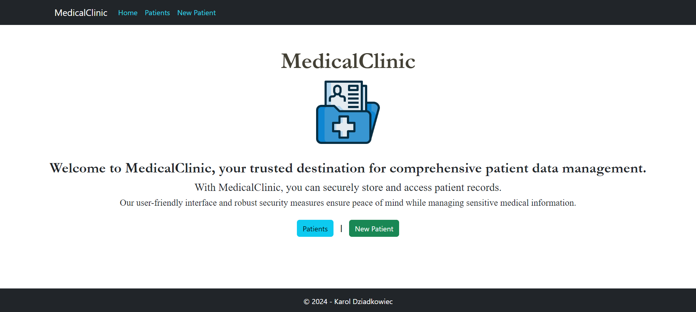

Adding a new patient:
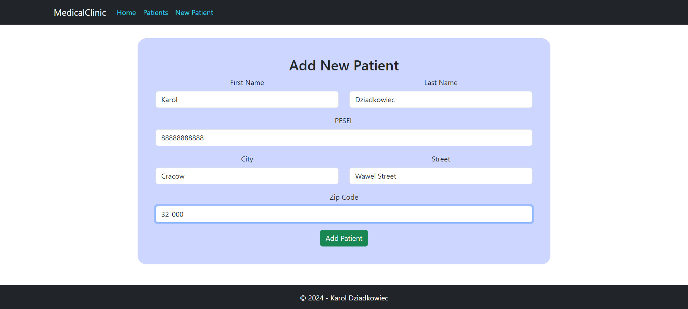

Displaying successful model:
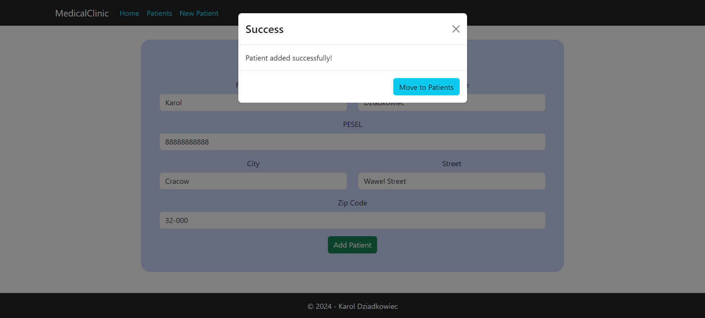

Listing patients:
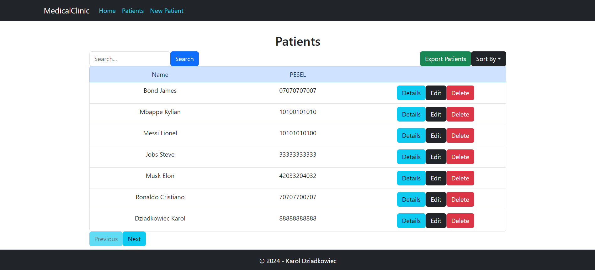

Displaying patient's data in modal:
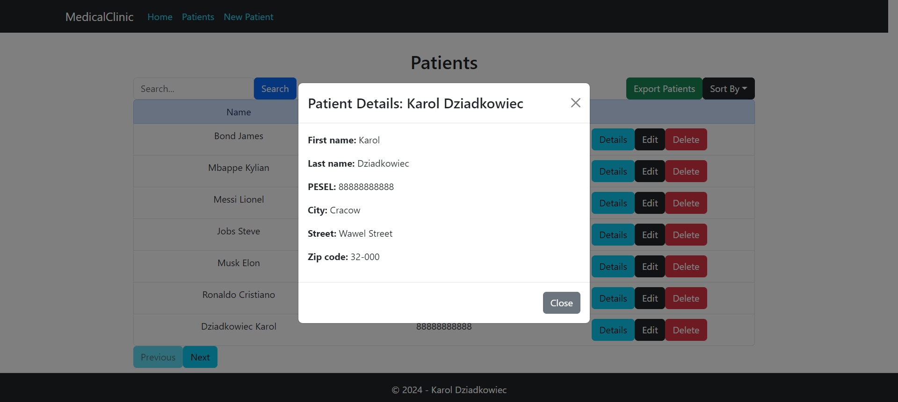

Editing patient's data in modal:
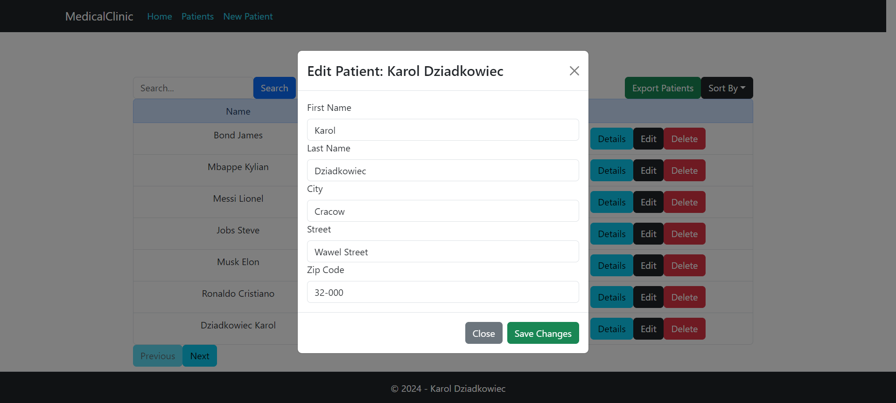

Pagination effects:
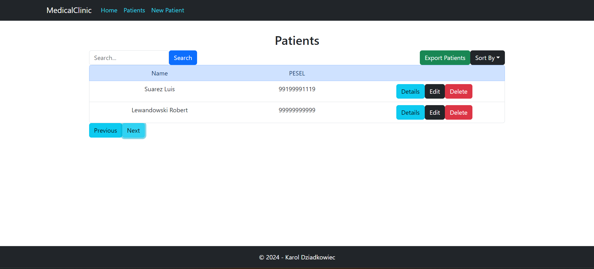

Searching by partial string:
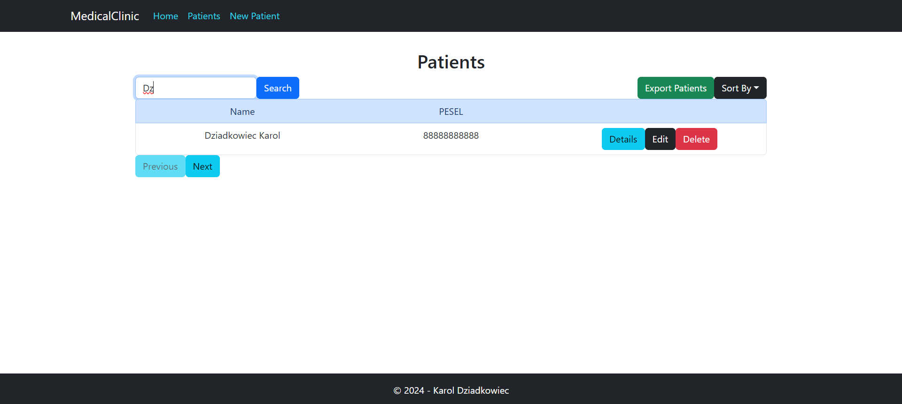

Removing patient:
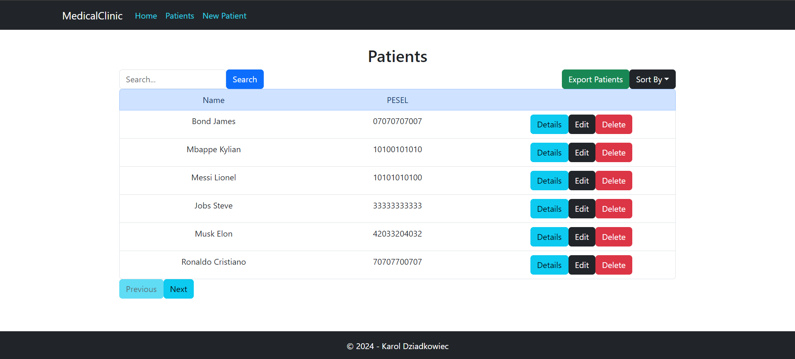

Sorting by last name:
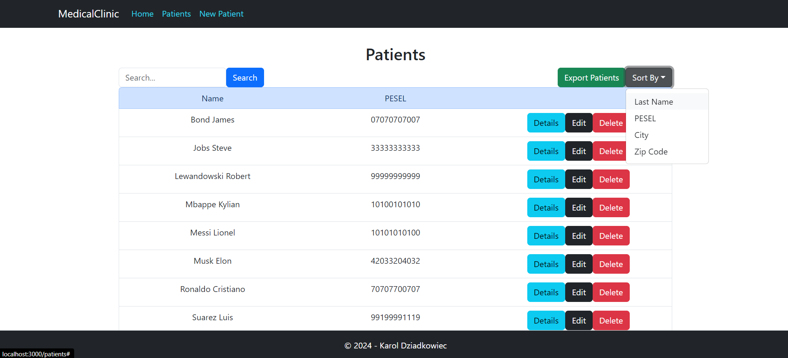

Exporting patient's data into Excel file:
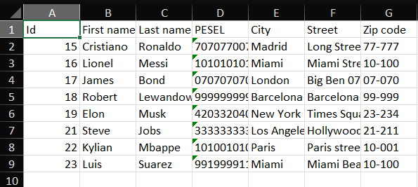

Unit testing repository methods via xUnit:
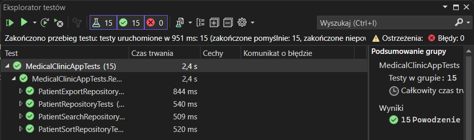

Mobile version of web app:

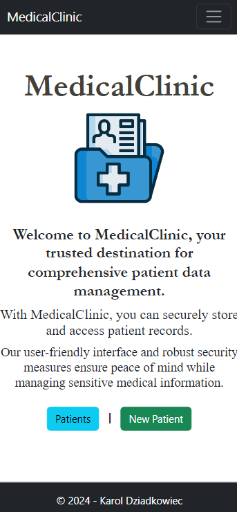

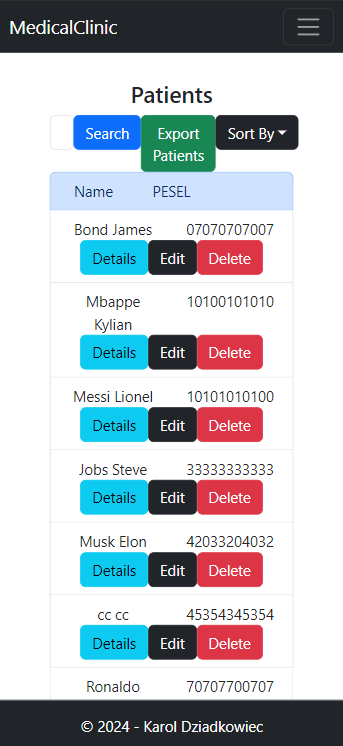

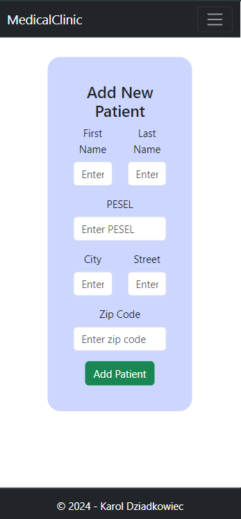
